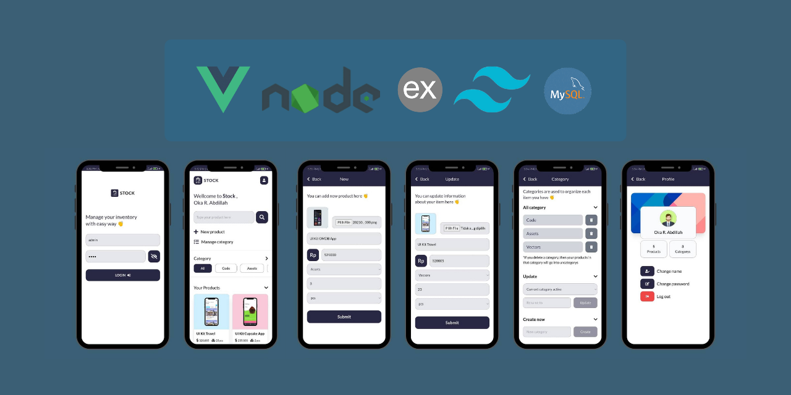

### Want To Sell !!
<h3 align="center">Stock APP</h3>

Manage Your Inventory With Easy Way

### About
Stock App adalah aplikasi pengelolaan inventaris berbasis website yang dibangun menggunakan Vue JS 3, Tailwindcss, Node JS, Express Js, dan MySql.
Aplikasi ini dapat mempermudah pengguna dalam mengelola inventarisnya. Konsep design yang minimalis dan mobile sangat cocok untuk pengguna yang sering beraktivitas menggunakan smartphone.

Aplikasi ini dapat mengelompokkan inventaris berdasarkan kategori yang diinputkan pengguna. Mudah dalam melakukan kustomisasi informasi inventaris dengan aplikasi ini. Pengguna juga dapat menggunakan fitur pencarian yang menambah kemudahan dalam mencari inventaris pengguna secara cepat.

Stock App sudah menerapkan konsep SPA atau <i>singgle page application</i> serta didukung dengan layanan backend yang dibangun menggunakan Node JS membuat aktivitas pengguna dalam menggunkan aplikasi ini menjadi jauh lebih cepat ketimbang teknologi <i>server side</i> lainnya.

### Case Study
- Saya mendapati seorang Pemilik Toko yang selama mengelola usahanya yang lambat laun seamakin besar mendapatkan banyak kendala dalam hal pengelolaan stok barang di toko nya. Dia sudah membuat pengelolaan berbasis MS Excel namun kurang maksimal dalam mengecek stok secara cepat dan sulit ketika harus bolak balik buka file excel hanya untuk melihat harga atau stok suatu produk.

### User Wants
- Si pemiik toko ingin ada aplikasi yang dapat membantu dia mengelola stok barang
- Ingin aplikasi tersebut bisa menampilkan informasi berupa visual dan text dari setiap product
- Ingin mengelola stok dengan lebih terorganisir dan rapi
- Bisa secara cepat mencari suatu produk yang dia inginkan

### Solutions
- Membuat sebuah aplikasi yang dapat meyimpan informasi produk seperti foto produk, nama produk, stok dan harga. Menghadirkan fitur pencarian produk dan membuat sistem pengkategorian produk yang bisa di kustom oleh si pemilik toko

### Research
- Si pemilik toko lebih sering menggunakan smartphone ketimbang device lainnya
- Melihat referensi mockup pada laman Dribbble dan beberapa account instagram
- Memisah antara aplikasi frontend dan aplikasi backend
- Menggunakan Vue JS sebagai framework untuk membangun aplikasi frontend
- Menggunakan Node JS dan library Express JS untuk membangun aplikasi backend
- Merancang dan membangun Rest Full API untuk handle request data dari aplikasi frontend
- Menyiapkan database dengan menggunakan MySQL sebagai DBMS 

### Wireframe Stock App
- [Wireframe](http://www.canva.com/design/DAErNM4L-Ms/IEN0uh8ILGYDAijapIMZLg/view?utm_content=DAErNM4L-Ms&utm_campaign=designshare&utm_medium=link&utm_source=homepage_design_menu#2)

### Functionality
#### User
- User dapat menambahkan produk baru
- User dapat mengubah atau menghapus sebuah produk
- User dapat mengkategorikan produk berdasarkan kategori yang user inginkan
- User dapat membuat, mengubah, atau menghapus sebuah kategori
- User dapat melakukan pencarian produk berdasarkan nama produk atau kategorinya
- User dapat mengubah display name pada aplikasi
- User dapat mengubah kata sandi

#### System
- Sistem hanya bisa membuat satu produk atau kategori baru dalam satu sesi ke dalam database
- Sistem hanya bisa menghapus satu produk atau kategori dalam satu sesi
- Jika user melakukan perubahan pada produk dengan mengubah image product, maka sistem akan menghapus image product sebelumnya dari server jika upload image product yang baru sukses
- Jika user tidak melakukan perubahan pada image product saat melakukan perubahan suatu produk, maka sistem tidak akan mengupload ulang image product
- Fitur pencarian berdasarkan keyword yang relevan dengan name product pada database Products
- Fitur pencarian hanya bisa menggunakan satu kategori spesifik saja saat digunakan
- Jika user menghapus suatu produk maka file image product tersebut juga akan dihapus dari server
- Jika user menghapus suatu kategori, maka produk yang menggunakan kategori tersebut akan di set ulang menjadi 'uncategorys'
- Jika user melakukan perubahan pada suatu kategori maka produk yang menggunakan kategori tersebut juga akan di set ulang berdasarkan kategori baru
- Sistem tidak bisa digunakan secara bersamaan jika menggunakan browser yang berbeda, harus login ulang dan salah satunya akan logout
- Jika user ingin mengubah kata sandi , maka aksi akan bisa dilakukan jika user berhasil melakukan konfirmasi kata sandi baru

### User target
- Pemilik Toko eceran maupun grosir skala kecil menengah atau seorang pengelola stok gudang yang dalam beraktivitas tidak memungkinkan menggunakan PC atau Laptop dalam melakukan pengelolaan.  
- Developer pemula yang baru memulai belajar stack teknologi Vue JS dan Node JS.
- Mahasiswa yang ingin memulai project atau penelitian untuk Tugas akhir atau skripsi.
 
### Main Technology
- Vue JS 3
- Tailwindcss
- Node JS
- Express JS
- MySql

### Get for free
- [Stock App - Client Application](https://github.com/or-abdillh/stock-app)
- [Stock API - Backend Application](https://github.com/or-abdillh/stock-api)

### Thanks 
- Support me with a cup of coffee and other snacks [here ..](https://saweria.co/orabdillh)
- Don't forget to give me star in this repository 🙏🏻🙏🏻
- See my other projects on instagram [@or_abdillh](http://www.instagram.com/or_abdillh)

[Oka R Abdillah ](http://github.com/or-abdillh)
 
Last edited on : 30/10/2021