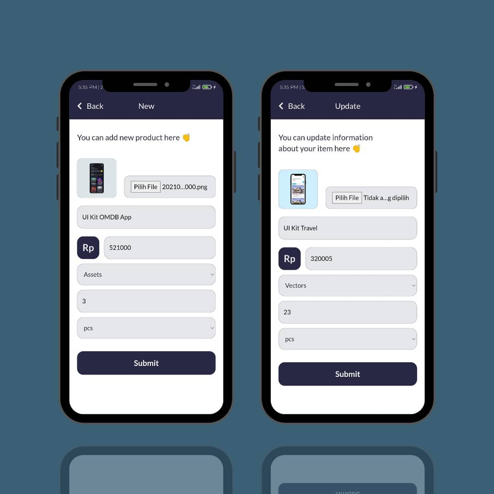
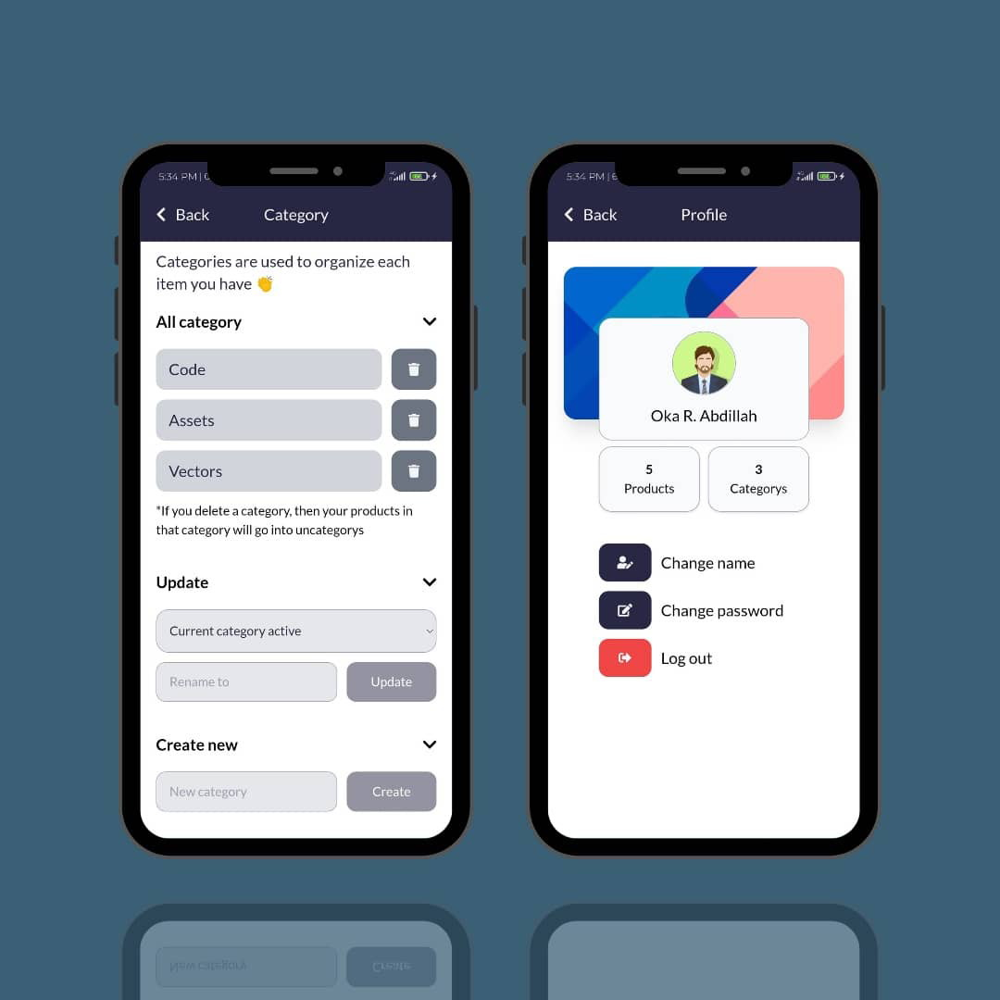

### Want To Sell !!
<h3 align="center">Stock APP</h3>

Manage Your Inventory With Easy Way

### About
Stock App adalah aplikasi pengelolaan inventaris berbasis website yang dibangun menggunakan Vue JS 3, Tailwindcss, Node JS, Express Js, dan MySql.
Aplikasi ini dapat mempermudah pengguna dalam mengelola inventarisnya. Konsep design yang minimalis dan mobile sangat cocok untuk pengguna yang sering beraktivitas menggunakan smartphone.

Aplikasi ini dapat mengelompokkan inventaris berdasarkan kategori yang diinputkan pengguna. Mudah dalam melakukan kustomisasi informasi inventaris dengan aplikasi ini. Pengguna juga dapat menggunakan fitur pencarian yang menambah kemudahan dalam mencari inventaris pengguna secara cepat.

Stock App sudah menerapkan konsep SPA atau <i>singgle page application</i> serta didukung dengan layanan backend yang dibangun menggunakan Node JS membuat aktivitas pengguna dalam menggunkan aplikasi ini menjadi jauh lebih cepat ketimbang teknologi <i>server side</i> lainnya.

### Case Study
- Saya mendapati seorang Pemilik Toko yang selama mengelola usahanya yang lambat laun seamakin besar mendapatkan banyak kendala dalam hal pengelolaan stok barang di toko nya. Dia sudah membuat pengelolaan berbasis MS Excel namun kurang maksimal dalam mengecek stok secara cepat dan sulit ketika harus bolak balik buka file excel hanya untuk melihat harga atau stok suatu produk.

### User Wants
- Si pemiik toko ingin ada aplikasi yang dapat membantu dia mengelola stok barang
- Ingin aplikasi tersebut bisa menampilkan informasi berupa visual dan text dari setiap product
- Ingin mengelola stok dengan lebih terorganisir dan rapi
- Bisa secara cepat mencari suatu produk yang dia inginkan

### Solution
- Membuat sebuah aplikasi yang dapat meyimpan informasi produk seperti foto produk, nama produk, stok dan harga. Menghadirkan fitur pencarian produk dan membuat sistem pengkategorian produk yang bisa di kustom oleh si pemilik toko

### Riset
- Si pemilik toko lebih sering menggunakan smartphone ketimbang device lainnya
- Melihat referensi mockup pada laman Dribbble dan beberapa account instagram
- Memisah antara aplikasi frontend dan aplikasi backend
- Menggunakan Vue JS sebagai framework untuk membangun aplikasi frontend
- Menggunakan Node JS dan library Express JS untuk membangun aplikasi backend
- Merancang dan membangun Rest Full API untuk handle request data dari aplikasi frontend
- Menyiapkan database dengan menggunakan MySQL sebagai DBMS 

### Wireframe Stock App
- [Wireframe](http://www.canva.com/design/DAErNM4L-Ms/IEN0uh8ILGYDAijapIMZLg/view?utm_content=DAErNM4L-Ms&utm_campaign=designshare&utm_medium=link&utm_source=homepage_design_menu#2)

### Features
- Create new product
- Update product
- Remove product
- Upload image to server
- Remove image from server
- Create category
- Rename category
- Create new category
- Remove category
- Product search by keyword
- Product search by category
- Change name 
- Change password
- Login with username and password
- Minimalist design UI

### User target
- Pemilik Toko eceran maupun grosir skala kecil menengah atau seorang pengelola stok gudang yang dalam beraktivitas tidak memungkinkan menggunakan PC atau Laptop dalam melakukan pengelolaan.  
- Developer pemula yang baru memulai belajar stack teknologi Vue JS dan Node JS.
- Mahasiswa yang ingin memulai project atau penelitian untuk Tugas akhir atau skripsi.
 
### Languages and Tools
- Vue JS 3
- Tailwindcss
- Font Awesome 5
- Google Fonts
- Node JS
- Express JS
- MySql
- Vite Js
- Termux
- Acode code editor
- Git
- API Client
- Google Chrome

### Backend Dependencies 
- body parser v.1.19.0
- cors v.2.8.5
- express v.4.17.1
- express fileupload v.1.2.1
- md5 v.2.3.0
- mysql v.2.18.1
- random token v.0.0.8
- nodemon 2.0.13

#### DM me [@or_abdillh](http://www.instagram.com/or_abdillh/)
#### Chat [whatsapp](http://api.whatsapp.com/send?phone=6285654036810)

### Demo 
- [Demo Stock App - Inventory Management](http://www.instagram.com/reel/CVMyBH1FOdB/?utm_medium=copy_link)

[Oka R Abdillah ](http://github.com/or-abdillh)
 
Last edited on : 19/10/2021